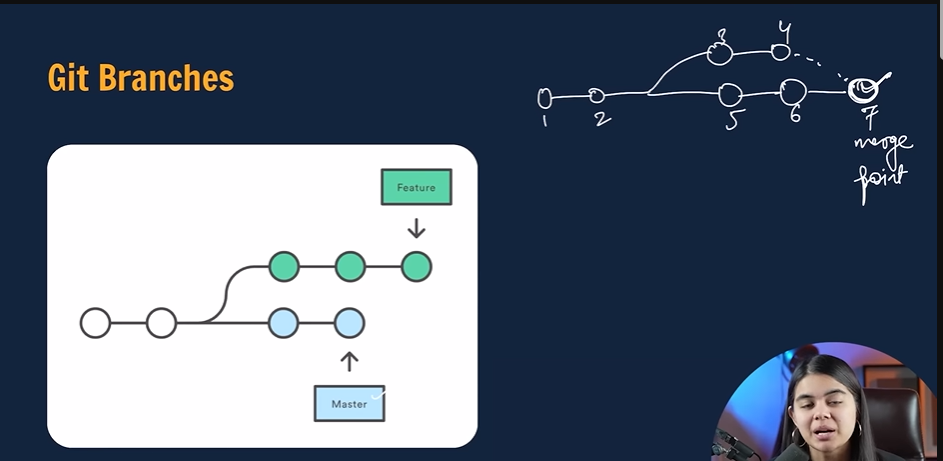

#This is my local repo

#Git Branches

git branch (to chech branch)

git branch -m main (rename branch)
git checkout -b <-new branch name-> ( to create new branch)
git branch -d <-branch name-> ( to delete branch)

Merging  Code

way1 

        git diff <-branch name->  (to compare commits, branches, files and more)

    git merge <-branch name ->

way2

create a PR(pull request)